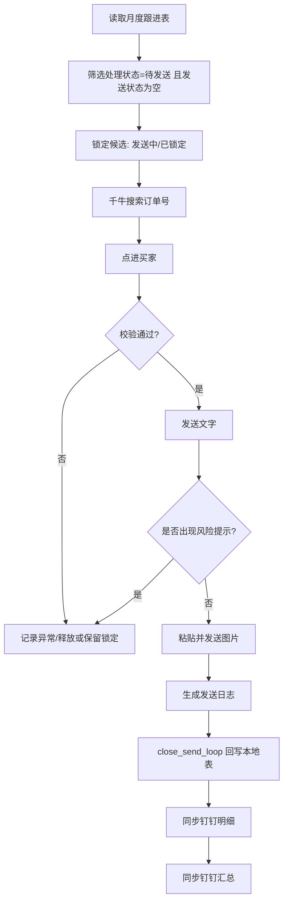

# 未发货仅退款客户挽回自动化运行手册

## 当前结论

截至 2026-07-01，本项目已经跑通“小量全自动闭环”：

1. 从月度跟进表挑选待发送客户。
2. 先锁定候选，避免重复发送或中途串状态。
3. 在千牛接待台搜索订单号。
4. 校验当前店铺、旺旺 ID、右侧客户订单号。
5. 自动发送文字，再发送图片。
6. 生成发送日志。
7. 回写本地月度跟进表。
8. 同步钉钉在线表明细和汇总。

已真实验证自动发送：

| 旺旺ID | 订单号 | 结果 |
| --- | --- | --- |
| babyshome | 5121761799573008902 | 已发送文字和图片，已回写 |
| 翎羽散灰湮儿 | 3310272266012108574 | 已发送文字和图片，已回写 |

## 核心流程



## 关键命令

预览下一批候选，不改表：

```powershell
& "C:\Users\Admin\.cache\codex-runtimes\codex-primary-runtime\dependencies\python\python.exe" tools\prepare_send_batch.py --limit 2 --shop "艺颂旗舰店"
```

锁定下一位候选：

```powershell
& "C:\Users\Admin\.cache\codex-runtimes\codex-primary-runtime\dependencies\python\python.exe" tools\prepare_send_batch.py --limit 1 --shop "艺颂旗舰店" --reserve
```

释放锁定：

```powershell
& "C:\Users\Admin\.cache\codex-runtimes\codex-primary-runtime\dependencies\python\python.exe" tools\prepare_send_batch.py --release-rows 14
```

发送完成后收口：

```powershell
& "C:\Users\Admin\.cache\codex-runtimes\codex-primary-runtime\dependencies\python\python.exe" tools\close_send_loop.py --log exports\send_auto_log_2026-07-01_lingyu.json
```

运行测试：

```powershell
& "C:\Users\Admin\.cache\codex-runtimes\codex-primary-runtime\dependencies\python\python.exe" -m unittest discover -s tests -v
```

## 字段口径

| 字段 | 用途 |
| --- | --- |
| 处理状态 | 流程主状态：待发送、发送中、已发送、发送异常、跳过 |
| 发送状态 | 发送动作状态：已锁定、已发送、部分发送 |
| 发送时间 | 自动发送或锁定时间 |
| 发送内容版本 | 话术版本，例如 refund_recovery_v1 |
| 发送详情 | 记录发送过程，不记录完整话术正文 |

完整话术内容保存在：

```text
message_templates/refund_recovery_v1.json
assets/refund_recovery/quality保障_三重保障.png
```

## 已踩坑与修正

### 1. 时间范围错误

错误：一开始理解成“前一日 00:00 到当前时间”。

修正：按业务要求固定为“前一日 00:00:00 到今日 23:59:59”。

代码验证点：

```text
tests/test_workflow.py::test_previous_day_window
```

### 2. 售后状态没有选全部

错误：组合查询里售后状态没有固定为“全部”。

修正：操作退款管理筛选时必须明确选择“售后状态=全部”。

### 3. 旺旺 ID 获取位置理解错

错误：曾尝试直接从退款列表理解客户信息。

修正：必须在千牛聊天界面搜索订单号，点进买家，再从右侧客户信息和订单区核对旺旺 ID。

### 4. 复制粘贴位置错误

错误：订单号曾被粘贴到聊天输入框，存在误发风险。

修正：先点击左侧搜索框，`Ctrl+A` 清空，再输入订单号。搜索结果出现买家后才点击。

### 5. 未切换客户导致重复发送

错误：曾对同一客户重复操作。

修正：发送前强制核对当前聊天标题、右侧客户信息、右侧客户订单号和表格锁定候选。任一不一致，停止发送。

### 6. 文字和图片间隔过长

现象：人工测试时文字和图片间隔约 1 分钟。

原因：人工确认和手动粘贴图片耗时。

修正：自动流程里文字发送后立即复制图片并粘贴发送，间隔明显缩短。

### 7. 千牛重复消息风险提示

现象：对“欣轩密封件”补发文字时出现重复消息风险提示。

修正：不点击“继续发送”；清空残留输入；标记为“发送异常 / 部分发送”；发送详情记录原因。

### 8. 本地 Excel 被 WPS 占用

现象：`refund_followup_2026-06.xlsx` 被 WPS 打开时无法覆盖保存。

修正：先另存 `_send_updated`；用户关闭占用后再覆盖。后续脚本会直接报错，避免静默失败。

### 9. 钉钉 CLI 中文长文本乱码

现象：部分中文详情写成问号。

原因：Windows 命令行传参和 JSON 转义混用时，中文或复杂标点被 CLI 解析坏。

修正：`DingTalkClient.update_range` 使用 `json.dumps(..., ensure_ascii=True)`；发送详情可以稳定写中文。

### 10. 汇总“已发送”重复计数

错误：处理状态和发送状态都叫“已发送”，导致汇总已发送被算两次。

修正：待发送、发送异常看“处理状态”；已发送、部分发送看“发送状态”；已加测试覆盖。

### 11. GitHub 推送命令行无法直连

现象：浏览器能打开 GitHub，但命令行 Git 无法连 `github.com:443`。

修正：使用本机代理：

```powershell
$env:HTTPS_PROXY='http://127.0.0.1:7890'
$env:HTTP_PROXY='http://127.0.0.1:7890'
```

## 扩批前检查清单

1. 千牛接待台已登录。
2. 当前店铺标签正确。
3. 本地表和钉钉在线表没有被手动编辑到结构错位。
4. `prepare_send_batch.py --limit 2` 候选正常。
5. 话术版本为预期版本。
6. 图片能正常复制到千牛输入区。
7. 发送前必须看到搜索结果买家名、右侧客户信息、右侧客户订单均与候选一致。
8. 出现任何千牛风险提示，停止该客户，不点继续发送。

## 当前仍需继续完善

1. 把千牛 UI 操作封装成正式脚本，而不是在会话里逐步执行。
2. 增加每 20 个客户暂停观察回复。
3. 增加失败截图留档。
4. 增加自动重试策略，但发送动作不能盲目重试。
5. 增加跨店铺自动切换和窗口校验。
6. 增加运行日报。
